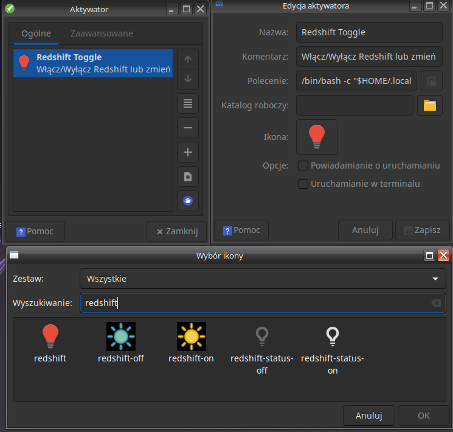
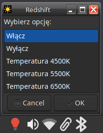

# Redshift XFCE Toggle

Skrypt instalacyjny umożliwiający szybkie dodanie przełącznika **Redshift** w panelu **XFCE** z wygodnym menu do:
- włączania/wyłączania Redshift,
- zmiany temperatury barwowej (4500K, 5500K, 6500K).

---

## 🧰 Wymagania

- System: **Linux MX** z środowiskiem **XFCE**
- Połączenie internetowe

> ℹ️ Wymagane pakiety (`redshift`, `curl`, `jq`, `yad`, `xfce4-settings`) zostaną **automatycznie zainstalowane** przez skrypt.

---

## 🚀 Instalacja

1. Pobierz i uruchom instalator:

   ```bash
   curl -s -o install.sh https://raw.githubusercontent.com/hattimon/redshift-xfce-toggle/main/install.sh
   chmod +x install.sh
   ./install.sh
   ```

2. Podaj kraj i miasto (np. `Poland`, `Warsaw`), gdy zostaniesz o to poproszony.

3. Po zakończeniu instalacji dodaj aktywator do panelu XFCE:

   - Kliknij **prawym przyciskiem myszy** na panelu XFCE.
   - Wybierz: `Panel` → `Dodaj nowy element`.
   - Wybierz: `Aktywator (Launcher)` i kliknij `Dodaj`.
   - Kliknij prawym przyciskiem na nowym aktywatorze → `Właściwości`.
   - Kliknij `Dodaj nowy pusty element` (lub ikonę `+`).

4. Wypełnij dane:

   - **Nazwa**: `Redshift Toggle`
   - **Komentarz (opcjonalnie)**: `Włącz/Wyłącz Redshift lub zmień ustawienia`
   - **Polecenie**:

     ```bash
     /bin/bash -c "$HOME/.local/bin/redshift-toggle --menu"
     ```
   - **Kliknij w Ikona** `Wpisz "Redshift" i wybierz ikone`
     

     

5. Kliknij `OK`, aby zapisać i zamknij okno właściwości.

7. Zrestartuj system (bez tego może nie działać prawidłowo)

8. Kliknij ikonę w panelu XFCE, aby otworzyć menu z opcjami:
   - `Włącz`
   - `Wyłącz`
   - `Temperatura 4500K`
   - `Temperatura 5500K`
   - `Temperatura 6500K`
   


> ⚠️ **Po zmianie temperatury barwowej należy ponownie wybrać opcję „Włącz”**, aby zastosować nowe ustawienia.

---

## ✨ Funkcje

- Wygodne włączanie/wyłączanie Redshift z poziomu panelu
- Zmiana temperatury barwowej: `4500K`, `5500K`, `6500K`
- Automatyczne uruchamianie Redshift przy starcie systemu

---

## 🛠️ Rozwiązywanie problemów

- **Menu kontekstowe się nie wyświetla?**  
  Upewnij się, że `yad` został zainstalowany:

  ```bash
  sudo apt install yad
  ```

- **Sprawdzenie działania skryptu i ewentualnych błędów**:

  ```bash
  bash -x ~/.local/bin/redshift-toggle --menu
  ```

---

## 📦 Pliki instalowane

- `~/.config/redshift/redshift.conf` – konfiguracja Redshift
- `~/.local/bin/redshift-toggle` – skrypt menu kontekstowego
- `~/.config/autostart/redshift.desktop` – autostart Redshift przy logowaniu
- `~/.local/share/applications/redshift-toggle.desktop` – wpis menu aplikacji

---

## 📄 Licencja

Ten projekt objęty jest licencją **MIT**. Zobacz plik [LICENSE](./LICENSE).

---

## 🧹 Odinstalowanie

Aby całkowicie usunąć Redshift Toggle i wszystkie powiązane pliki:

1. Pobierz skrypt deinstalacyjny:

   ```bash
   curl -s -o uninstall.sh https://raw.githubusercontent.com/hattimon/redshift-xfce-toggle/main/uninstall.sh
   chmod +x uninstall.sh
   ./uninstall.sh
   ```

2. Usuń aktywator z panelu XFCE, klikając na niego prawym przyciskiem myszy → `Usuń`.

> Skrypt usuwa tylko pliki zainstalowane przez Redshift Toggle — Twoje osobiste dane i inne ustawienia Redshift nie są ruszane.
